# Untitled Diagram Documentation

## Summary

- [Introduction](#introduction)
- [Database Type](#database-type)
- [Table Structure](#table-structure)
  - [Listings Table](#listings-table)
  - [Calendar Table](#calendar-table)
  - [Reviews Table](#reviews-table)
- [Relationships](#relationships)
- [Database Diagram](#database-diagram)

## Introduction

Este documento descreve a estrutura de um banco de dados projetado para armazenar informações de listagens, calendário e avaliações para propriedades de hospedagem. O banco de dados é projetado para ser utilizado em uma aplicação que exibe e gerencia informações de acomodações, ajudando anfitriões a manterem suas listagens atualizadas e permitindo que os hóspedes deixem avaliações.

---

## Database Type

- **Database System**: PostgreSQL

## Table Structure

### Listings Table

| Name                            | Type          | Settings                         | References               | Note                         |
|---------------------------------|---------------|----------------------------------|---------------------------|------------------------------|
| **id**                          | INTEGER       | 🔑 PK, Not Null, Unique          |                           | Identificador único da listagem |
| **listing_url**                 | VARCHAR(255)  | Not Null                         |                           | URL da listagem no site    |
| **scrape_id**                   | INTEGER       | Not Null                         |                           | ID de scrape para rastreamento |
| **last_scraped**                | DATE          | Not Null                         |                           | Data da última coleta      |
| **source**                      | VARCHAR(50)   | Not Null                         |                           | Fonte de origem da listagem |
| **name**                        | VARCHAR(100)  | Not Null                         |                           | Nome da listagem           |
| **description**                 | TEXT          | Not Null                         |                           | Descrição da listagem      |
| **neighborhood_overview**       | TEXT          |                                  |                           | Visão geral do bairro      |
| **picture_url**                 | VARCHAR(255)  | Not Null                         |                           | URL da imagem principal    |
| **host_id**                     | INTEGER       | Not Null                         |                           | Identificador do anfitrião |
| **host_url**                    | VARCHAR(255)  | Not Null                         |                           | URL do perfil do anfitrião |
| **host_name**                   | VARCHAR(255)  | Not Null                         |                           | Nome do anfitrião          |
| **host_since**                  | DATE          |                                  |                           | Data de cadastro do anfitrião |
| **host_location**               | VARCHAR(255)  |                                  |                           | Localização do anfitrião   |
| **host_about**                  | TEXT          |                                  |                           | Sobre o anfitrião          |
| **host_response_time**          | VARCHAR(50)   |                                  |                           | Tempo de resposta do anfitrião |
| **host_response_rate**          | VARCHAR(10)   |                                  |                           | Taxa de resposta           |
| **host_acceptance_rate**        | VARCHAR(10)   |                                  |                           | Taxa de aceitação          |
| **host_is_superhost**           | BOOLEAN       |                                  |                           | Indicador de superhost     |
| **host_thumbnail_url**          | VARCHAR(255)  |                                  |                           | URL da miniatura do anfitrião |
| **latitude**                    | FLOAT         | Not Null                         |                           | Latitude da propriedade    |
| **longitude**                   | FLOAT         | Not Null                         |                           | Longitude da propriedade   |
| **property_type**               | VARCHAR(50)   | Not Null                         |                           | Tipo de propriedade        |
| **room_type**                   | VARCHAR(50)   | Not Null                         |                           | Tipo de quarto             |
| **accommodates**                | INTEGER       | Not Null                         |                           | Número de hóspedes suportados |
| **bathrooms**                   | FLOAT         |                                  |                           | Quantidade de banheiros    |
| **price**                       | FLOAT         | Not Null                         |                           | Preço por noite            |
| **availability_365**            | INTEGER       |                                  |                           | Dias disponíveis no ano    |
| **review_scores_rating**        | FLOAT         |                                  |                           | Nota de avaliação média    |
| **reviews_per_month**           | FLOAT         |                                  |                           | Avaliações por mês         |

Outros campos podem ser adicionados de forma semelhante, detalhando as informações pertinentes da listagem.

### Calendar Table

| Name             | Type          | Settings                   | References             | Note                           |
|------------------|---------------|----------------------------|-------------------------|--------------------------------|
| **listing_id**   | INTEGER       | 🔑 PK, Not Null, Unique    | listings(id)            | Relacionamento com a tabela `listings` |
| **date**         | DATE          | Not Null                   |                         | Data específica no calendário |
| **available**    | BOOLEAN       | Not Null                   |                         | Indica se está disponível     |
| **price**        | FLOAT         |                            |                         | Preço na data específica      |
| **adjusted_price** | FLOAT       |                            |                         | Preço ajustado para a data    |

### Reviews Table

| Name              | Type          | Settings                      | References              | Note                           |
|-------------------|---------------|-------------------------------|--------------------------|--------------------------------|
| **listing_id**    | INTEGER       | 🔑 PK, Not Null, Unique       | listings(id)             | Relacionamento com a tabela `listings` |
| **id**            | INTEGER       | Not Null                      |                          | Identificador da avaliação     |
| **date**          | DATE          | Not Null                      |                          | Data da avaliação              |
| **reviewer_id**   | INTEGER       | Not Null                      |                          | ID do avaliador               |
| **reviewer_name** | VARCHAR(255)  | Not Null                      |                          | Nome do avaliador             |
| **comments**      | TEXT          |                               |                          | Comentários da avaliação      |

---

## Relationships

- **listings to calendar**: Um `listing` pode ter múltiplos `calendar` associados (relação de um-para-muitos).
- **listings to reviews**: Um `listing` pode ter múltiplas `reviews` associadas (relação de um-para-muitos).

---

## Database Diagram

```mermaid
erDiagram
	listings }o--|| calendar : references
	listings }o--|| reviews : references

	listings {
		INTEGER id
		VARCHAR(255) listing_url
		INTEGER scrape_id
		DATE last_scraped
		VARCHAR(50) source
		VARCHAR(100) name
		TEXT description
		TEXT neighborhood_overview
		VARCHAR(255) picture_url
		INTEGER host_id
		VARCHAR(255) host_url
		VARCHAR(255) host_name
		DATE host_since
		VARCHAR(255) host_location
		TEXT host_about
		VARCHAR(50) host_response_time
		VARCHAR(10) host_response_rate
		VARCHAR(10) host_acceptance_rate
		BOOLEAN host_is_superhost
		VARCHAR(255) host_thumbnail_url
		VARCHAR(255) host_picture_url
		VARCHAR(100) host_neighbourhood
		INTEGER host_listings_count
		INTEGER host_total_listings_count
		TEXT host_verifications
		BOOLEAN host_has_profile_pic
		BOOLEAN host_identity_verified
		VARCHAR(100) neighbourhood
		VARCHAR(100) neighbourhood_cleansed
		VARCHAR(100) neighbourhood_group_cleansed
		FLOAT latitude
		FLOAT longitude
		VARCHAR(50) property_type
		VARCHAR(50) room_type
		INTEGER accommodates
		FLOAT bathrooms
		VARCHAR(50) bathrooms_text
		INTEGER bedrooms
		INTEGER beds
		TEXT amenities
		FLOAT price
		INTEGER minimum_nights
		INTEGER maximum_nights
		INTEGER minimum_minimum_nights
		INTEGER maximum_minimum_nights
		INTEGER minimum_maximum_nights
		INTEGER maximum_maximum_nights
		FLOAT minimum_nights_avg_ntm
		FLOAT maximum_nights_avg_ntm
		VARCHAR(50) calendar_updated
		BOOLEAN has_availability
		INTEGER availability_30
		INTEGER availability_60
		INTEGER availability_90
		INTEGER availability_365
		DATE calendar_last_scraped
		INTEGER number_of_reviews
		INTEGER number_of_reviews_ltm
		INTEGER number_of_reviews_l30d
		DATE first_review
		DATE last_review
		FLOAT review_scores_rating
		FLOAT review_scores_accuracy
		FLOAT review_scores_cleanliness
		FLOAT review_scores_checkin
		FLOAT review_scores_communication
		FLOAT review_scores_location
		FLOAT review_scores_value
		VARCHAR(255) license
		BOOLEAN instant_bookable
		INTEGER calculated_host_listings_count
		INTEGER calculated_host_listings_count_entire_homes
		INTEGER calculated_host_listings_count_private_rooms
		INTEGER calculated_host_listings_count_shared_rooms
		FLOAT reviews_per_month
	}

	calendar {
		INTEGER listing_id
		DATE date
		BOOLEAN available
		FLOAT price
		FLOAT adjusted_price
		INTEGER minimum_nights
		INTEGER maximum_nights
	}

	reviews {
		INTEGER listing_id
		INTEGER id
		DATE date
		INTEGER reviewer_id
		VARCHAR(255) reviewer_name
		TEXT comments 
	}
```

